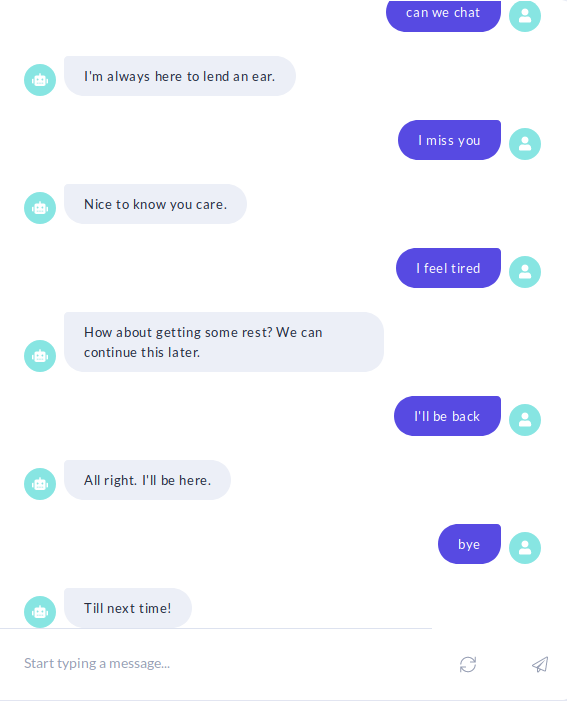

# Beep - Small Talk Chatbot

A conversational AI chatbot built with Rasa that specializes in small talk interactions.



## Features

- Handles a wide variety of small talk interactions
- Natural, engaging responses with personality
- Fallback handling for out-of-scope queries
- Modern NLU pipeline with DIET classifier

## Setup and Installation

### Prerequisites

- Python 3.7 or above
- pip

### Installation Steps

1. Clone this repository
2. Create a virtual environment (recommended):
   ```
   python -m venv venv
   source venv/bin/activate  # On Windows: venv\Scripts\activate
   ```
3. Install the required dependencies:
   ```
   pip install rasa
   ```

## Training the Model

```
cd src
rasa train
```

## Running the Bot

To run the bot in the command line:

```
cd src
rasa shell
```

To run the bot with a REST API:

```
cd src
rasa run --enable-api
```

## Project Structure

- `src/config.yml`: NLU and policy configuration
- `src/domain.yml`: Bot domain with intents, actions, and responses
- `src/data/nlu.md`: Training data for NLU
- `src/data/stories.md`: Conversation flows

## Extending the Bot

### Adding New Intents

1. Add the intent to `domain.yml`
2. Add example utterances to `data/nlu.md`
3. Add a response template to `domain.yml`
4. Add a story to `data/stories.md`
5. Retrain the model

## License

This project is open source.

## Acknowledgements

- [Rasa](https://rasa.com/) for the powerful conversational AI framework